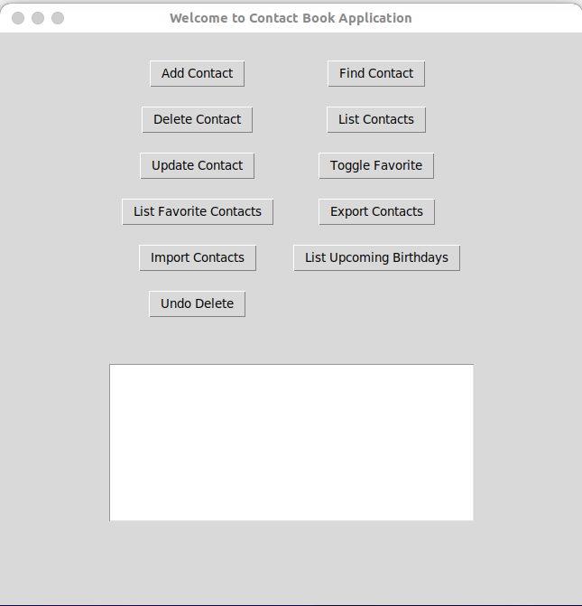
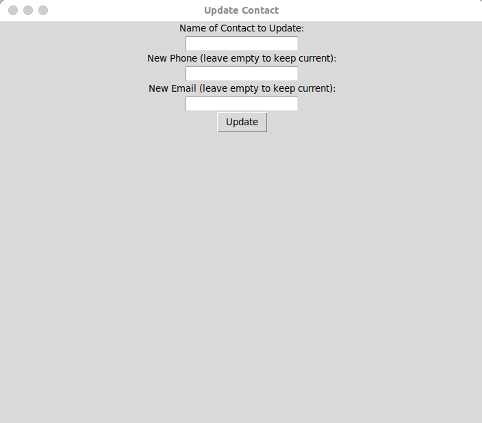
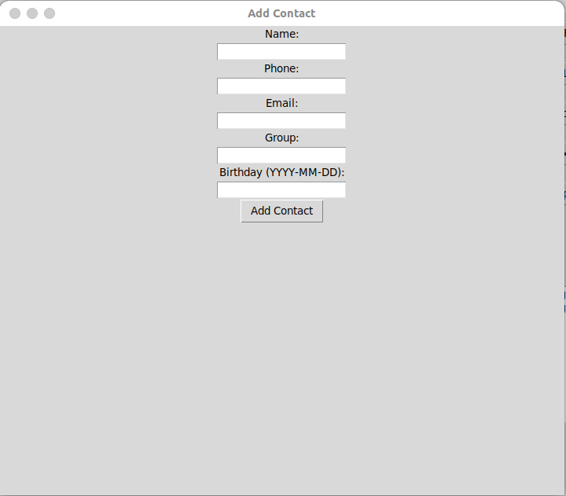

# P RO J E CT : CONTACT BOOK APPLICATION

Welcome to Project , where we will apply our knowledge Algorithms to 
create something practical and engaging: a
Contact Book Application. This project is a fantastic way to see how
data structures like binary search trees (BSTs) can be used in real-
world applications. Our contact book will allow users to add, delete,
search, and list contacts. The searching functionality will be powered
by binary search, making the process efficient even with a large
number of contacts.
This project will not only reinforce your understanding of BSTs and
binary search but also give you hands-on experience in building a
functional application.
Implementing the Basic Structure
The first step in our project is to define the basic structure for storing
contact information. We'll use a binary search tree, where each node
will represent a contact with details like name, phone number, and
email.

# Contact Book Application

## Description
The Contact Book Application is a Python-based GUI application that allows users to efficiently manage their contacts. Built using Tkinter, the application supports various functionalities, including adding, finding, updating, deleting contacts, and managing favorites. It also features birthday tracking and CSV import/export capabilities.

## Features
- Add new contacts with name, phone number, email, and birthday.
- Find contacts by name.
- Update existing contact details.
- Delete contacts.
- Mark contacts as favorites.
- List favorite contacts and upcoming birthdays within a specified timeframe.
- Import and export contacts to and from CSV files.
- User-friendly interface with easy navigation.

## Technologies Used
- **Python**: The programming language used for the application.
- **Tkinter**: The GUI toolkit for creating the user interface.
- **CSV**: For importing and exporting contact data.
- **Datetime**: For managing birthday dates and upcoming birthdays.

## Installation
To set up the Contact Book Application, follow these steps:

1. **Clone the repository**:
   ```bash
   git clone <repository-url>
   cd contact-book-application

    Ensure you have Python installed on your system. Download it from python.org.

    Run the application:

    bash

    python contact_book_app.py

Usage

    Launch the Application: Run the application to open the main window.

    Adding a Contact: Click "Add Contact" to open the add contact window. Enter the required details and click "Add".

    Finding a Contact: Click "Find Contact" to search for a contact by name.

    Updating a Contact: Use the "Update Contact" option to change the details of an existing contact.

    Deleting a Contact: Click "Delete Contact" and enter the contact's name to remove them from your list.

    Toggling Favorite Status: Mark or unmark a contact as a favorite using the "Toggle Favorite" option.

    Listing Contacts: View all contacts or just favorite contacts using the respective buttons.

    Managing Birthdays: List upcoming birthdays within a specified number of days.

    Importing and Exporting Contacts: Use the respective buttons to import contacts from a CSV file or export the current contacts to a CSV file.

Application Structure

graphql

contact_book_app.py         # Main application file
contact.py                  # Contains Contact class definition
binary_search_tree.py       # Contains Binary Search Tree class definition
README.md                   # Documentation file
contacts.csv                # Example contacts CSV file (if applicable)

Future Enhancements

    Implement fuzzy matching for search functionality.
    Add data validation for phone numbers and emails.
    Enable user authentication for enhanced data security.
    Implement a more advanced database system (e.g., SQLite) for contact storage.

Contributing

Contributions are welcome! Please follow these steps:

    Fork the repository.
    Create a new branch for your feature or bug fix.
    Commit your changes and push to the branch.
    Create a pull request explaining your changes.

License

This project is licensed under the MIT License. See the LICENSE file for details.


# Screenshots 






